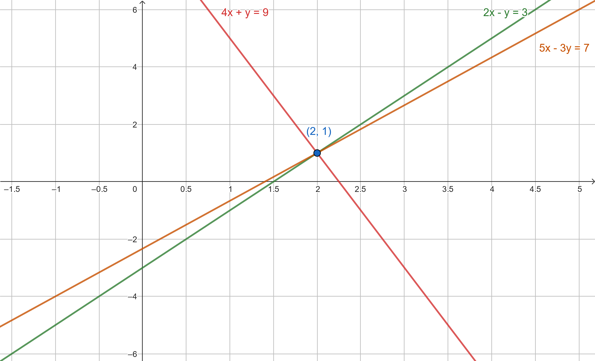
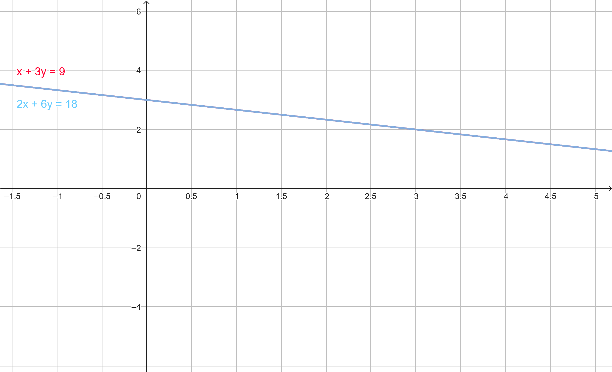
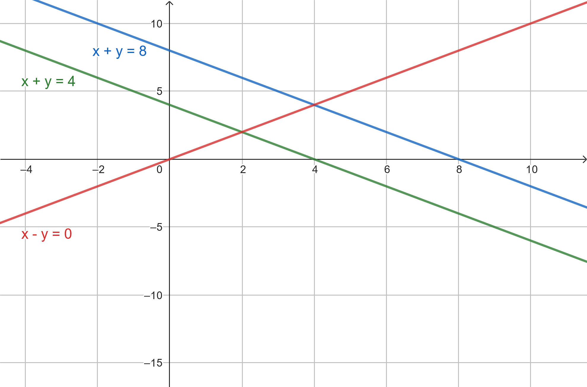

Let's consider a problem where we have to buy oranges and apples but under the following conditions.
*  The difference between 2X the number of oranges and the number of apples should be 3.
* The sum of 4X the number of oranges and the number of apples should be 9.
* The difference between 5X the number of oranges and 3X the number of apples should be 7.

# System of Linear Equations
These conditions could be modeled using the following equations

$$2x-y=3\tag{1}$$

$$4x+y=9\tag{2}$$

$$5x-3y=7\tag{3}$$

where $x$ and $y$ are the number of oranges and apples respectively. Collectively, these equations would be called a **system of linear equations** of variables $x$ and $y$.

We can also represent this system of linear equations using matrices as follows.

$$\begin{bmatrix} 2x - y \\\ 4x+y \\\ 5x-3y \end{bmatrix} = \begin{bmatrix} 3 \\\ 9  \\\ 7\end{bmatrix}$$

# Row Picture

The representation of a system of linear equations as a <a href="/posts/linear-algebra/matrices/#multiplication-of-matrices" target="_blank">matrix multiplication</a> product of the coefficients and the variable matrix is called the **row picture**. Each row represents a different linear equation.

$$\begin{bmatrix} 2 & -1 \\\ 4 & 1 \\\ 5 & -3 \end{bmatrix} \times \begin{bmatrix} x \\\ y \end{bmatrix} = \begin{bmatrix} 3 \\\ 9  \\\ 7\end{bmatrix}$$

As a linear algebra equation, this could be written as $\textbf{Ax=b}$. Where $\textbf{A}$ is the matrix of coefficients, $\textbf{x}$ is the vector of variables, and $\textbf{b}$ is the vector of constants.

# Column Picture
Alternatively, the coefficients of the variable $x$ and $y$ could be separated into two matrices as follows.

$$\begin{bmatrix} 2 \\\ 4 \\\ 5 \end{bmatrix} x \ + \begin{bmatrix} -1 \\\ 1 \\\ -3 \end{bmatrix}y = \begin{bmatrix} 3 \\\ 9  \\\ 7\end{bmatrix}$$

this is the **column picture** of the system of linear equations.

# Solution of Linear Equations
The value of variables that satisfies all equations is called the **solution** (or solutions if there are multiple) of the system of linear equations.

## One Solution
If we plot equations $(1)$, $(2)$, and $(3)$ on a 2D graph

The point at which all three lines intersect will be the solution of the linear equations i.e. $(2, 1)$.

## Infinitely Many Solutions
Consider the following system of linear equations.

$$x+3y=9 \tag{4}$$

$$2x+6y=18\tag{5}$$

If we plot them on a 2D graph, both lines overlap over each other.

The set of values for $x$ and $y$ for which both equations are satisfied is infinitely large.
We can also observe this from the fact that if we multiply the equation $(4)$ by $2$ we get the equation $(5)$.

$$2 \times (x+3y = 9)$$

$$2x + 2\cdot3y = 2\cdot 9$$

$$2x+6y=18$$

Thus, the equation $(5)$ is just the equation $(4)$ scaled up by 2.

## No Solution
It is also possible for a system of linear equations that none of the variable values satisfy all the equations, like the following.

$$x+y=4 \tag{6}$$

$$x+y=8\tag{7}$$$$x-y=0 \tag{8}$$

Although we have multiple points of intersection between the lines, there is no single point where all three lines intersect. Thus, for no common values of $x$ and $y$ equations $(6)$, $(7)$, and $(8)$ are satisfied.

# Elimination Method
To find the values of $x$ and $y$ in the system of linear equations $(1)$, $(2)$, and $(3)$, we can start by eliminating one of the variables from any of the equations.

If we multiply the equation $(2)$ by $3$

$$3 \times (4x+y=9) $$

$$12x + 3y = 27 \tag{9}$$

and add it to the equation $(3)$

$$(5x - 3y)+(12x+3y) = 7+27$$

$$5x+12x-3y+3y=34$$

$$17x=34$$

$$x=2$$

Now that we know the value of $x$ we can substitute it into any equation (like equation $(2)$) to find the value of $y$.

$$4 \times 2 + y = 9$$

$$8 + y = 9$$

$$y=9-8$$

$$y=1$$

To verify if $(2, 1)$ is indeed the solution of the system of linear equations $(1)$, $(2)$, and $(3)$ we can test the values in the equation $(1)$.

$$2x-y=3$$

$$2 \times 2 - 1 = 3$$

$$4-1 = 3$$

$$3=3$$

Thus, we can confirm that $(2, 1)$ is the solution.
 
# Gaussian Elimination
The **Gaussian Elimination** is an algorithm for finding the solution of a system of linear equations by performing row-wise operation on the matrix of coefficients and constants. It is named after Carl Friedrich Gauss. 

It is similar to the *elimination method* discussed above, the difference is that the operations are performed collectively on the matrix. It involves the following steps.
1. Expressing the system of linear equations with matrices, in the row picture form.
2. Creating an augmented matrices of coefficients and constants.
3. Reducing the augmented matrix to its row echelon form.
4. Breaking the row echelon form of the augmented matrix back to its row picture form.
5. Solving the reduced equations to find the values of variables.

Let's apply the Gaussian Elimination on the row picture of equations $(1)$, $(2)$, and $(3)$

$$\begin{bmatrix} 2 & -1 \\\ 4 & 1 \\\ 5 & -3 \end{bmatrix} \times \begin{bmatrix} x \\\ y \end{bmatrix} = \begin{bmatrix} 3 \\\ 9  \\\ 7\end{bmatrix}$$

## Augmented Matrix of Coefficients and Constants
First, we have to create an augmented matrix from the coefficient and constants matrix of the row picture.

$$\begin{bmatrix} 2 & -1 & | & 3 \\\ 4 & 1 & | & 9 \\\ 5 & -3 & | & 7\end{bmatrix}$$

Then, we reduce this augmented matrix to its row echelon form.

## Row Echelon Form
The **row echelon form** of a matrix is an <a href="/posts/linear-algebra/matrices/#triangular-matrix" target="_blank">upper-triangular matrix</a> representation (the last row of the matrix could be just $0$s) of the augmented matrix.

To obtain the row echelon form, we can perform <a href="/posts/linear-algebra/matrices/#addition-and-subtraction-of-matrices" target="_blank">matrix addition</a>, <a href="/posts/linear-algebra/matrices/#multiplication-and-division-with-a-scalar-value" target="_blank">scalar multiplication</a> (with values other than $0$) and swaps between the rows of the augmented matrix. 

Initially, the first element in the <a href="/posts/linear-algebra/matrices/#diagonal-of-a-matrix" target="_blank">diagonal</a> of the matrix is the **pivot**. All the elements below the pivot have to be reduced to $0$s by performing scalar multiplication and matrix addition/subtraction between the pivot row and the rows below it. 

$$\begin{bmatrix} {\color{blue} 2} & -1 & | & 3 \\\ 4 & 1 & | & 9 \\\ 5 & -3 & | & 7\end{bmatrix}$$

After that, we move on to the next pivot (next element in the diagonal) and repeat the process until we obtain the row echelon form.
If the next pivot element candidate is zero then we won't be able to reduce the elements below it to zero by just scalar multiplication and matrix addition/subtraction. In such cases, we perform a swap between the next row and any other row below it to obtain a non-zero element as the pivot.

If we multiply row 1 of the augmented matrix with the scalar value ${5 \over 2}$ 

$${5 \over 2} \times \begin{bmatrix} 2 & -1 & | & 3\end{bmatrix} = \begin{bmatrix} 5 & {-5 \over 2} & | & {15 \over 2}\end{bmatrix}$$

and subtract it from row 3 we will obtain the following matrix.

$$\begin{bmatrix} 2 & -1 & | & 3 \\\ 4 & 1 & | & 9 \\\ 5-5 & -3+{5 \over 2} & | & 7-{15 \over 2}\end{bmatrix}$$

$$\begin{bmatrix} 2 & -1 & | & 3 \\\ 4 & 1 & | & 9 \\\ 0 & {-1 \over 2} & | & {-1 \over 2}\end{bmatrix}$$

Next, to reduce the last element under the pivot to $0$, we can multiply row 1 with the scalar value $2$ 

$$2 \times \begin{bmatrix} 2 & -1 & | & 3 \end{bmatrix} = \begin{bmatrix} 4 & -2 & | & 6\end{bmatrix}$$

and subtract it from row 2.

$$\begin{bmatrix} 2 & -1 & | & 3 \\\ 4-4 & 1+2 & | & 9-6 \\\ 0 & {-1 \over 2} & | & {-1 \over 2}\end{bmatrix}$$

$$\begin{bmatrix} 2 & -1 & | & 3 \\\ 0 & 3 & | & 3 \\\ 0 & {-1 \over 2} & | & {-1 \over 2}\end{bmatrix}$$

Now, we move on to the next pivot.

$$\begin{bmatrix} 2 & -1 & | & 3 \\\ 0 & {\color{blue} 3} & | & 3 \\\ 0 & {-1 \over 2} & | & {-1 \over 2}\end{bmatrix}$$

To reduce the element below the pivot to zeros we can multiply row 2 with the scalar value $1 \over 6$

$${1 \over 6} \times \begin{bmatrix} 0 & 3 & | & 3 \end{bmatrix} = \begin{bmatrix} 0 & {1 \over 2} & | & {1 \over 2} \end{bmatrix}$$

and add it to row 3

$$\begin{bmatrix} 2 & -1 & | & 3 \\\ 0 & 3 & | & 3 \\\ 0+0 & {-1 \over 2}+{1 \over 2} & | & {-1 \over 2}+{1 \over 2}\end{bmatrix}$$

$$\begin{bmatrix} 2 & -1 & | & 3 \\\ 0 & 3 & | & 3 \\\ 0 & 0 & | & 0\end{bmatrix}$$

This is the row echelon form the augmented matrix created by equation $(1)$, $(2)$, and $(3)$. Notice that the number of non-zero elements in the diagonal ($2$ and $3$) equals to the number of variables in the equations ($x$ and $y$).

## Back Substitution
If we break the row echelon form of the augmented matrix back into the row picture we will obtain the reduced linear equations.

$$\begin{bmatrix} 2 & -1 \\\ 0 & 3 \end{bmatrix} \times \begin{bmatrix} x \\\ y\end{bmatrix} = \begin{bmatrix} 3 \\\ 3\end{bmatrix}$$

$$\begin{bmatrix} 2x-y \\\ 3y \end{bmatrix} = \begin{bmatrix} 3 \\\ 3\end{bmatrix}$$

By solving these equations for the values of $y$

$$3y=y$$

$$y=1$$

and $x$

$$2x-y=3$$

$$2x - 1 = 3$$

$$2x = 3+1$$

$$2x=4$$

$$x=2$$

we have obtained the solution of the system of linear equations i.e. $(2, 1)$ which is the same solution that we got from the elimination method and the graph.

## Infinitely many solutions
Applying Gaussian Elimination to the system of linear equations $(4)$ and $(5)$.
* Creating the augmented matrix

$$\begin{bmatrix} 1 & 3 & | & 9 \\\ 2 & 6 & | & 18 \end{bmatrix}$$

* Selecting the pivot element.

$$\begin{bmatrix} {\color{blue} 1} & 3 & | & 9 \\\ 2 & 6 & | & 18 \end{bmatrix}$$

* Calculating the row echelon form by multiplying row 1 by the scalar value $2$ and subtracting it from row 2.

$$\begin{bmatrix} 1 & 3 & | & 9 \\\ 0 & 0 & | & 0\end{bmatrix}$$

The number of non-zero elements in the diagonal ($1$) is lower than the number of variables in the equation ($x$ and $y$).

After converting the row echelon form back to the row picture we get back the equation $(4)$ which can have infinitely many solutions like $(1, 2)$, $(0, 3)$, $(9, 0)$, etc.

## No Solution
Following is the application of Gaussian elimination on the system of linear equations $(6)$, $(7)$, and $(8)$
* Creating the augmented matrix.  

$$\begin{bmatrix} 1 & 1 & | & 4 \\\ 1 & 1 & | & 8 \\\ 1 & -1 & | & 0\end{bmatrix}$$

* Selecting the pivot element.

$$\begin{bmatrix} {\color{blue} 1} & 1 & | & 4 \\\ 1 & 1 & | & 8 \\\ 1 & -1 & | & 0\end{bmatrix}$$

* Subtracting row 1 from row 2

$$\begin{bmatrix} 1 & 1 & | & 4 \\\ 0 & 0 & | & -4 \\\ 1 & -1 & | & 0\end{bmatrix}$$

* Subtracting row 1 from row 3

$$\begin{bmatrix} 1 & 1 & | & 4 \\\ 0 & 0 & | & -4 \\\ 0 & -2 & | & -4\end{bmatrix}$$

* Since the next pivot candidate is $0$, we'll have to swap rows 2 and 3 and make $-2$ the new pivot element.

$$\begin{bmatrix} 1 & 1 & | & 4 \\\ 0 & {\color{blue} -2} & | & -4 \\\ 0 & 0 & | & -4 \end{bmatrix}$$

We can't reduce this further without disrupting the row echelon form. The number of non-zero elements in the diagonal ($1$, $-2$, and $-4$) is higher than the number of variables in the equations ($x$ and $y$).

The reduced equations obtained after converting this back to row picture are:

$$x+y=4 \tag{10}$$

$$-2y=-4 \tag{11}$$

$$0=-4 \tag{12}$$

The equation $(12)$ is a fallacy. Thus, we can confirm that there is no solution for the system of linear equations $(10)$, $(11)$, and $(12)$.

# Resources
<a href="https://youtu.be/QVKj3LADCnA?si=CXmVqn42IgpG8lwO" target="_blank">2. Elimination with Matrices.</a>  
<a href="https://medium.com/linear-algebra/part-1-linear-equation-of-two-variables-and-matrices-d8de21eb8d51" target="_blank">Part 1 : Linear equation of two variables and Matrices</a>  
<a href="https://medium.com/linear-algebra/part-5-row-picture-and-column-picture-899e6d834564" target="_blank">Part 5 : Row Picture and Column Picture</a>  
<a href="https://medium.com/linear-algebra/part-6-gaussian-elimination-b1ad4a279a74" target="_blank">Part 6 : Gaussian Elimination</a>  
