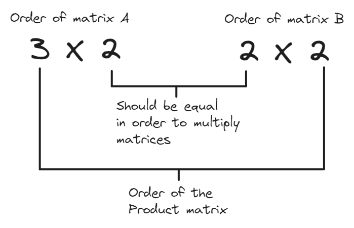

A matrix is a rank 2 <a href="/posts/linear-algebra/tensors/" target="_blank">tensor</a> i.e. an array expanding in a maximum of two independent dimensions. 

Multiple <a href="/posts/linear-algebra/vectors/" target="_blank">vectors</a> could be arranged in rows or columns to create a matrix.

$$\vec{a} = \begin{bmatrix} 5 \\\ 6 \\\ 7 \end{bmatrix}\ \ \vec{b} = \begin{bmatrix} 7 \\\ 9 \\\ 10 \end{bmatrix}$$

$$\textbf{A} = \begin{bmatrix} \vec{a} & \vec{b} \end{bmatrix} = \begin{bmatrix} 5 & 7 \\\ 6 & 9 \\\ 7 & 10 \end{bmatrix}$$

$$\textbf{B} = \begin{bmatrix} \vec{a} \\\ \vec{b} \end{bmatrix} = \begin{bmatrix} 5 & 6 & 7 \\\ 7 & 9 & 10 \end{bmatrix}$$

The term *matrix* encompasses all vectors so $\vec{a}$ and $\vec{b}$ could be called matrices or vectors interchangeably. 

# Order of a matrix
The notation of the number of $rows \times columns$ of a matrix is called its **order**. For example, the following matrix has order $3 \times 4$.

$$\begin{bmatrix} 1 & 8 & 99 & 0 \\\ 56 & 43 & 91 & 2 \\\ 9 & 5 & 33 & 1 \end{bmatrix}$$

Vectors are matrices with an order of either $n \times 1$ or $1 \times n$.

# Diagonal of a matrix
The **diagonal** of the matrix refers to the elements from the top left corner to the bottom right corner of the matrix (highlighted below).

$$\begin{bmatrix}  {\color {red} 4} & 9 & 5 \\\ 9 & {\color{red} 3} & 1 \\\ 90 & 2 & {\color{red} 8}\end{bmatrix} \ \ \ \begin{bmatrix}  {\color {red} 5} & 9 & 5 & 98 \\\ 9 & {\color{red} 43} & 1 & 1 \\\ 90 & 2 & {\color{red} 9} & 52\end{bmatrix}$$

# Square Matrix
A matrix with an equal number of rows and columns is called a **square matrix**. For example:

$$\begin{bmatrix} 1 & 8 & 9 \\\ 2 & 0 & 11 \\\ 9 & 7 & 1\end{bmatrix}$$

## Triangular Matrix
A **triangular matrix** is a type of square matrix where either the elements above or below the diagonal are all $0$s.

Here is an example of an **upper triangular matrix**

$$\begin{bmatrix} \color{red} 6 & \color{red} 21 & \color{red} 6 & \color{red} 88 \\\ 0 & \color{red} 71 & \color{red} 90 & \color{red} 8 \\\ 0 & 0 & \color{red} 1 & \color{red} 71 \\\ 0 & 0 & 0 & \color{red} 4 \end{bmatrix}$$

Following is an example of a **lower triangular matrix**

$$\begin{bmatrix} \color{red} 6 &  0 &  0 &  0 \\\ \color{red} 7 & \color{red} 71 & 0 & 0 \\\ \color{red} 12 & \color{red} 61 & \color{red} 1 & 0 \\\ \color{red} 4 & \color{red} 6 & \color{red} 5 & \color{red} 4 \end{bmatrix}$$

# Matrix Operations
## Equality of Matrices
Two matrices are equal if 
1. They have the same order.
2. The values of the corresponding elements are the same.

Given a matrix $\textbf{A} = \begin{bmatrix} 1 & 2 \\\ 3 & 4 \end{bmatrix}$ and a matrix $\textbf{B} = \begin{bmatrix} 1 & 2 \\\ 3 & 4 \end{bmatrix}$ we can say that $\textbf{A} = \textbf{B}$ because the order of both matrices is $2 \times 2$ and the elements corresponding to same position are also equal. 

## Addition and Subtraction of Matrices
To add two matrices we just have to sum the elements at corresponding positions. The order of both matrices should be the same for addition (and subtraction).

$$\begin{bmatrix} 4 & 5 & 9 \\\ 89 & 5 & 91 \end{bmatrix} + \begin{bmatrix} 9 & 4 & 8 \\\ 9 & 1 & 85 \end{bmatrix} = \begin{bmatrix} 4+9 & 5+4 & 9+8 \\\ 89+9 & 5+1 & 91+85  \end{bmatrix} = \begin{bmatrix} 13 & 9 & 17 \\\ 98 & 6 & 176 \end{bmatrix}$$

The subtraction operation is similar to the addition.

$$\begin{bmatrix} 9 & 4 & 8 \\\ 9 & 1 & 85 \end{bmatrix} - \begin{bmatrix} 4 & 5 & 9 \\\ 89 & 5 & 91 \end{bmatrix}  = \begin{bmatrix} 9-4 & 4-5 & 8-9 \\\ 9-89 & 1-5 & 85-91  \end{bmatrix} = \begin{bmatrix} 5 & -1 & -1 \\\ -80 & -4 & -6 \end{bmatrix}$$

## Multiplication and Division with a Scalar Value
If we want to multiply a matrix with a <a href="/posts/linear-algebra/tensors/#scalar-rank-0-tensor" target="_blank">scalar</a> value, we just have to multiply the scalar with each element individually.

$$5 \times \begin{bmatrix} 7 & 6 \\\ 8 & 4 \end{bmatrix} = \begin{bmatrix} 7 \times 5 & 6 \times 5 \\\ 8 \times 5 & 4 \times 5 \end{bmatrix} = \begin{bmatrix} 35 & 30 \\\ 40 & 20 \end{bmatrix}$$

Division operation with a scalar value is also applied similarly on the matrix.

$$\begin{bmatrix} 9 & 6 \\\ 12 & 36 \end{bmatrix} \div 3 = \begin{bmatrix} 9 & 6 \\\ 12 & 36 \end{bmatrix} \times {1 \over 3} = \begin{bmatrix} {9 \over 3} & {6 \over 3} \\\ {12 \over 3} & {36 \over 3} \end{bmatrix} = \begin{bmatrix} 3 & 2 \\\ 4 & 12 \end{bmatrix}$$

## Transpose of a Matrix
The **transpose** operation on a matrix swaps the elements in its rows and columns. For example, if we apply the transpose operation on the matrix $\textbf{C} = \begin{bmatrix} 4 & 5 & 8 \\\ 6 & 7 & 9 \end{bmatrix}$ the result would be $\textbf{C}^T = \begin{bmatrix} 4 & 6 \\\ 5 & 7 \\\ 8 & 9 \end{bmatrix}$.

Notice that the order of the matrix is also changed from $2 \times 3$ to $3 \times 2$.

### Symmetric Matrix
A matrix is **symmetric** if it remains unchanged after the transpose operation is applied i.e. $\textbf{C}^T = \textbf{C}$. The following matrix is an example of a symmetric matrix:

$$\left(\begin{bmatrix} 9 & 5 & 89 \\\ 5 & 8 & 67 \\\ 89 & 67 & 34\end{bmatrix}\right)^T = \begin{bmatrix} 9 & 5 & 89 \\\ 5 & 8 & 67 \\\ 89 & 67 & 34\end{bmatrix}$$

### Skew-Symmetric Matrix
If we perform the transpose operation on a skew-symmetric matrix the result will be the original matrix multiplied by the scalar value $(-1)$ i.e. $\textbf{C}^T = (-1) \times \textbf{C}$.

$$\left(\begin{bmatrix} 9 & 5 & 89 \\\ -5 & 8 & 67 \\\ -89 & -67 & 34\end{bmatrix}\right)^T = \begin{bmatrix} 9 & -5 & -89 \\\ 5 & 8 & -67 \\\ 89 & 67 & 34\end{bmatrix}$$

## Multiplication of Matrices
To calculate the product of two matrices we have to take the <a href="/posts/linear-algebra/vectors/#dot-product" target="_blank">dot product</a> of each row from the first matrix with every column of the second matrix.

$$\textbf{A} \times \textbf{B} = \begin{bmatrix} a_{11} & a_{12} \\\ a_{21} & a_{22} \\\ a_{31} & a_{32} \end{bmatrix} \times \begin{bmatrix} b_{11} & b_{12} \\\ b_{21} & b_{22}  \end{bmatrix} = \begin{bmatrix} a_{11}b_{11} +a_{12}b_{21} & a_{11}b_{12} +a_{12}b_{22} \\\ a_{21}b_{11} +a_{22}b_{21} & a_{21}b_{12} +a_{22}b_{22} \\\ a_{31}b_{11} +a_{32}b_{21} & a_{31}b_{12} +a_{32}b_{22}\end{bmatrix}$$

Because the dot product could only be calculated between the vectors with identical number of elements, to multiply two matrices the number of columns in the first matrix should be equal to the number of rows in the second matrix.

If we switch the matrix $\textbf{A}$ and $\textbf{B}$ while performing multiplication the resulting product matrix will have different dimensions (and elements). Thus,  *matrix multiplication is not commutative*.
$$\textbf{A} \times \textbf{B} \neq \textbf{B} \times \textbf{A}$$

### Identity Matrix
A square matrix with $1$s on its diagonal (and $0$s as non-diagonal elements) is called an **identity matrix**. Multiplying any matrix with an identity matrix (of valid order) is analogous to multiplying a number with $1$.

In equations, the identity matrix is represented with $\textbf{I}$

$$\textbf{A} \times \textbf{I} = \textbf{A}$$
$$\begin{bmatrix} 7 & 1 & 8 \\\ 4 & 5 & 3 \\\ 1 & 2 & 6 \end{bmatrix} \times \begin{bmatrix} 1 & 0 & 0 \\\ 0 & 1 & 0 \\\ 0 & 0 & 1 \end{bmatrix} = \begin{bmatrix} 7 & 1 & 8 \\\ 4 & 5 & 3 \\\ 1 & 2 & 6 \end{bmatrix}$$

### Null Matrix
If multiplication with identity matrix is analogous to multiplication with $1$ then multiplication with null matrix will be analogous to multiplication of a number with $0$.
A null matrix has only $0$s as elements and doesn't have to be a square matrix. It is represented as $\textbf{0}$ in equations.

$$\textbf{A} \times \textbf{0} = \textbf{0}$$
$$\begin{bmatrix} 7 & 1 & 8 \\\ 4 & 5 & 3 \\\ 1 & 2 & 6 \end{bmatrix} \times \begin{bmatrix} 0 & 0 & 0 \\\ 0 & 0 & 0 \\\ 0 & 0 & 0 \end{bmatrix} = \begin{bmatrix} 0 & 0 & 0 \\\ 0 & 0 & 0 \\\ 0 & 0 & 0 \end{bmatrix}$$

### Idempotent Matrix
A matrix when multiplied by itself remains unchanged, is called an **idempotent matrix**.
$$\textbf{A} \times \textbf{A} = \textbf{A}^{2} = \textbf{A}$$
Since the order of the product matrix has to be the same as the original matrix, an idempotent matrix must always be a square matrix.
All identity matrices are idempotent.

## Division of Matrices
If we have to divide a matrix with another matrix

$$\textbf{A} \div \textbf{B} = {\textbf{A} \over \textbf{B}}$$

we can rephrase it as

$$\textbf{A} \times {\textbf{I} \over \textbf{B}} = \textbf{A} \times \textbf{B}^{-1}$$

### Inverse of a Matrix
The matrix $\textbf{B}^{-1}$ will be called the **inverse** of the matrix $\textbf{B}$.
$$\textbf{B} \times \textbf{B}^{-1} = \textbf{I}$$
The inverse matrix has the same order as the original matrix. 
We can find the inverse of any square matrix using the process of <a href="/posts/linear-algebra/gauss-jordan-elimitation/" target="_blank">Gauss-Jordan Elimination</a>.

# Resources
<a href="https://www.khanacademy.org/math/precalculus/x9e81a4f98389efdf:matrices/x9e81a4f98389efdf:properties-of-matrix-multiplication/a/matrix-multiplication-dimensions" target="_blank">Matrix multiplication dimensions</a>  
<a href="https://medium.com/linear-algebra/part-2-operations-on-matrices-3caab542aebd" target="_blank">Part 2 : Operations on Matrices</a>  
<a href="https://medium.com/linear-algebra/part-3-types-of-matrices-diagonal-and-transpose-151418a47c06" target="_blank">Part 3 : Types of Matrices, Diagonal, and Transpose</a>  
