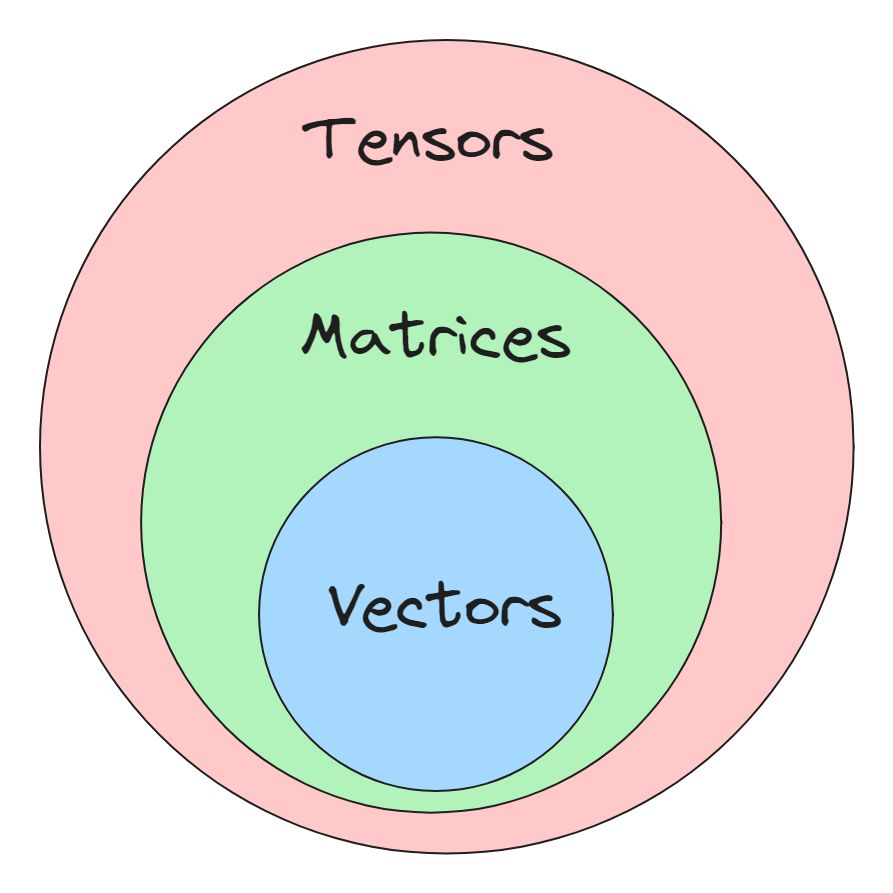
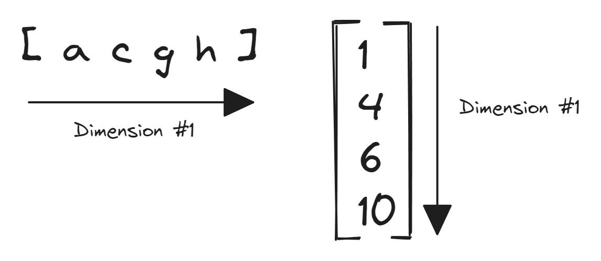
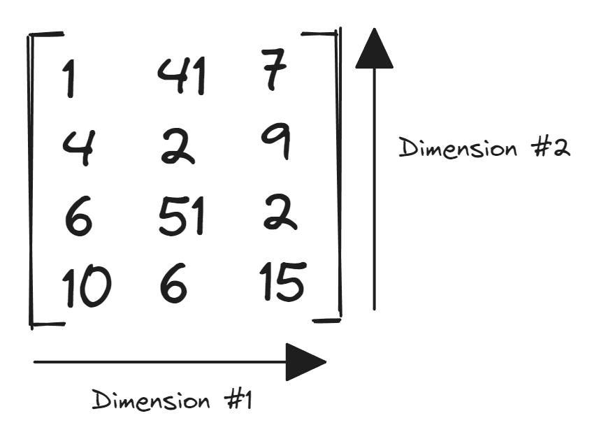
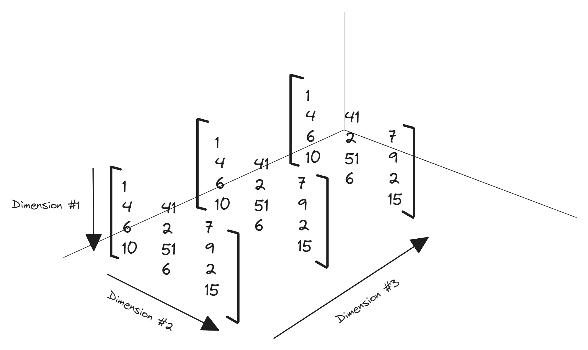

In linear algebra, a **tensor** is an array of data expanding in multiple (or zero) independent dimensions. It is used to represent quantities/equations/functions with multiple components, for example, the equation $3x+2y=0$ could be represented with the tensor $[3\ 2\ 0]$ where each value in the tensor represents the different components of the equation.

The number of independent dimensions of a tensor is called its **rank**.

Vectors and matrices could be generalized with the term tensor. The following Venn diagram visualizes the connection between them.

<p align="center"></p>

# Scalar (Rank 0 Tensor)
A rank 0 tensor does not expand in any dimension, it is used to represent quantities that could be expressed by just one component i.e. its magnitude or scale. For example, the distance of $8\ cm$ between two points could be represented by the tensor $[ 8 ]$.

Since the value of a rank 0 tensor signifies only its *scale* or *magnitude* it could be called a **scalar** value. A scalar value could represent the mass of an object, the temperature of a room, the speed of a car, etc.

# Vector (Rank 1 Tensor)
A rank 1 tensor (or a **vector**) expands in one dimension i.e. it represents values with more than one component.

<p align="center"></p>

Vectors are used to represent the magnitude and direction of different components of quantities such as displacement of an object, velocity of a car, electric field generated by a particle, etc. For example, displacement of $5\ m$ in the east direction and $10\ m$ in the north direction for an object could be represented with the vector $[5\ 10]$ where each component represents displacement in the east and north direction respectively.

In equations, vectors are denoted as bold letters ($\textbf{E}$) or letters with an arrow on top ($\vec{E}$).

## Magnitude of a Vector
To obtain the magnitude/scalar value of a vector we have to square all of its components and take the square root of their sum. For example, the magnitude of the displacement vector in the example above i.e. the distance between the start and the end will be $$|\ [ 0\ 5 \ 0 \ 10]\ | = \sqrt{0^2 + 5^2 + 0^2 + 10^2} = 25+100 = 125\ m$$
The magnitude of a vector is denoted by enclosing it within $|\ \ |$, for example, $|\vec{E}|$.

# Matrix (Rank 2 Tensor)
A rank 2 tensor (or a **matrix**) expands in two independent dimensions.
<p align="center"></p>

A *system of linear equations*
$$x - 2y = 6$$
$$ x - y = 4 $$
$$ x + y = 0 $$
could be represented using a matrix as
$$ \begin{bmatrix} 1 & -2 & 6 \\ 1 & -1 & 4\\ 1 & 1 & 0\end{bmatrix}$$
This matrix has three rows and three columns. Thus, its **order** will be $3 \times 3$.
A matrix with one row or one column could be called a matrix or vector interchangeably.

# Tensors (Rank >=3)
The following diagram visualizes a rank 3 tensor in a 3-dimensional plane.
<p align="center"></p>

Tensors with the rank greater than 3 are difficult to visualize but they could be represented as nested arrays in any programming language.
```python
# The following array has four levels of nesting
rank_4_tensor = [
    [
        [
            [
                6, 7, 8
            ],
            [
                8, 58, 26
            ]
        ],
        [
            [
                5, 28, 19
            ],
            [
                10, 11, 12
            ]
        ]
    ],
    [
        [
            [
                13, 14, 15
            ],
            [
                16, 17, 18
            ]
        ],
        [
            [
                19, 20, 21
            ],
            [
                22, 23, 24
            ]
        ]
    ]
]
```

# Resources
<a href="https://www.youtube.com/watch?v=f5liqUk0ZTw" target="_blank">What's a Tensor?</a>  
<a href="https://mathworld.wolfram.com/TensorRank.html" target="_blank">Tensor Rank</a>  
<a href="https://medium.com/linear-algebra/part-1-linear-equation-of-two-variables-and-matrices-d8de21eb8d51" target="_blank">Part 1 : Linear equation of two variables and Matrices</a>  
<a href="https://medium.com/linear-algebra/part-4b-tensors-scalars-and-vectors-68cf6c1f2be" target="_blank">Part 4B : Tensors, Scalars, Vectors, and Matrices</a>  
