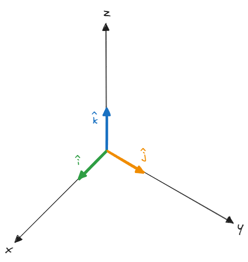

A vector could represent the magnitude of a quantity broken down into its various components, for example, the velocity of an object moving on a 2D plane could be represented using the vector $\vec{v} = \begin{bmatrix} 8 & 9 \end{bmatrix}$.

On a 2D plane $8$ and $9$ could be called the horizontal and vertical components of the vector $\vec{v}$ respectively. But the words *horizontal* and *vertical* on a 2D or 3D plane are relative to the viewer (try rotating the figure above anti-clockwise). 

By using **unit vectors** $\hat{i}$, $\hat{j}$, and $\hat{k}$ (vectors with <a href="/posts/linear-algebra/tensors/#magnitude-of-a-vector" target="_blank">magnitude</a> 1 along the x, y, and z axis respectively) we can define the orientation of each component of the vector. Thus, vector $\vec{v}$ could be redefined as $8\hat{i} + 9\hat{j} + 0\hat{k}$ in a 3D plane or $8\hat{i} + 9\hat{j}$ on a 2D plane.
  

<small><i>Unit vectors along the x, y, and z axis</i></small>

# Projections
We can break the vector into its components if we know the angle between the vector and any of the axes.

Assuming we have a vector $\vec{v}$ from the origin, we can draw a circle on the plane with radius $|\vec{v}|$ (magnitude of the vector). To break it into two components along the x and y axis we can draw a *projection* line starting from the tip of the vector to both axes.

From the figure above we can assess that 

$$ \vec{v}_{x} = |\vec{v}| \times {\vec{v}_x \over |\vec{v}|} = |\vec{v}|\cos(\theta) $$

$$ \vec{v}_{y} = |\vec{v}| \times {\vec{v}_y \over |\vec{v}|} = |\vec{v}|\sin(\theta) $$

Thus, the vector components of $\vec{v}$ along the x and y axis are $|\vec{v}|\cos(\theta)$ and $|\vec{v}|\sin(\theta)$ respectively, where $\theta$ is the angle between the vector and the x-axis.

Similarly, we can find the projection of a vector on another vector. For example, we have two vectors $\vec{v}$ and $\vec{u}$ subtended by the angle $\phi$.

<small><i>Projection of $\vec{v}$ on $\vec{u}$</i></small>

The component of $\vec{v}$ on vector $\vec{u}$ will be $|\vec{v}| \cos(\phi)$, but this is just a scalar value. To add direction we have to include $\hat{u}$, the unit vector along the direction of $\vec{u}$. Thus, the **projection vector** of $\vec{v}$ on $\vec{u}$ is $|\vec{v}| \cos(\phi) \hat{u}$.
# Dot Product
The **dot product** of two vectors is calculated by multiplying the projection of the first vector with the magnitude of the second vector. It quantifies the similarity in the direction of both vectors. 

$$ \vec{v} \cdot \vec{u} = |\vec{v}||\vec{u}|\cos(\phi)$$
The dot product operation is *commutative*, so it doesn't matter if we multiply the projection of $\vec{v}$ with the magnitude of $\vec{u}$ or vice-versa.
$$\vec{v} \cdot \vec{u} = |\vec{v}||\vec{u}|\cos(\phi) = |\vec{u}||\vec{v}|\cos(\phi) = \vec{u} \cdot \vec{v}$$

<small><i>Projection of $\vec{v}$ on $\vec{u}$ and projection of $\vec{u}$ on $\vec{v}$</i></small>

We can also calculate the dot product by multiplying the corresponding elements of both vectors and adding them up.

$$\vec{v} \cdot \vec{u} = \begin{bmatrix} 1 \\\ 1 \end{bmatrix} \cdot \begin{bmatrix} 3 \\\ -2 \end{bmatrix} = 1 \times 3 + 1 \times (-2) = 1$$

# Cross Product
The **cross product** of two vectors returns a vector that is perpendicular to the direction of both vectors.

The magnitude of the resulting vector of the cross product is equal to the area of the parallelogram created by the two vectors.

The length of the sides of the parallelogram will be $|\vec{v}|$ and $|\vec{u}|$.

Hence, from the area of the parallelogram we can calculate the magnitude of the cross product of vectors $\vec{u}$ and $\vec{v}$
$$| \vec{u} \times \vec{v}| = |\vec{u}||\vec{v}|\sin(\phi)$$

Unlike the dot product, the cross product is not commutative.
$$\vec{u} \times \vec{v} \neq \vec{v} \times \vec{u}$$

If we have to find the cross product of two vectors using their elements, we have to create a matrix of both vectors and calculate its <a href="/posts/linear-algebra/determinants/" target="_blank">determinant</a>.

$$\vec{u} \times \vec{v} = \begin{bmatrix} u_1 \\\ u_2 \end{bmatrix} \times \begin{bmatrix} v_1 \\\ v_2 \end{bmatrix} = \begin{vmatrix} u_1 & v_1 \\\ u_2 & v_2 \end{vmatrix} = u_1 v_2 - v_1 \ u_2$$

# Hadamard Product
Named after Jacques Hadamard, the **Hadamard product** is the resultant matrix after the multiplication of corresponding elements of two vectors or matrices.
$$\vec{v} \odot \vec{u} = \begin{bmatrix} v_1 \\\ v_2 \end{bmatrix} \odot \begin{bmatrix} u_1 \\\ u_2 \end{bmatrix} = \begin{bmatrix} v_1 \times u_1 \\\ v_2 \times u_2 \end{bmatrix}$$
The result of the Hadamard product will be the same irrespective of the order of multiplication. Thus, it is commutative.
$$\vec{v} \odot \vec{u} = \vec{u} \odot \vec{v}$$
Some use cases of the Hadamard product operation are JPEG image compression and LSTM (Long Short-Term Memory) cells of RNNs (Recurrent Neural Networks). It is also known as Schur Product (named after Issai Schur).

# Resources
<a href="https://medium.com/linear-algebra/part-12-vectors-a99364499121" target="_blank">Part 12 : Vectors</a>  
<a href="https://www.khanacademy.org/math/precalculus/x9e81a4f98389efdf:vectors/x9e81a4f98389efdf:component-form/v/vector-components-from-magnitude-and-direction" target="_blank">Vector components from magnitude & direction</a>  
<a href="https://medium.com/linear-algebra/part-13-vector-components-b78a61be3817" target="_blank">Part 13 : Vector Components</a>  
<a href="https://www.youtube.com/watch?v=LyGKycYT2v0" target="_blank">Dot products and duality | Chapter 9, Essence of linear algebra</a>  
<a href="https://medium.com/linear-algebra/part-14-dot-and-hadamard-product-b7e0723b9133" target="_blank">Part 14 : Dot and Hadamard Product</a>  
<a href="https://www.youtube.com/watch?v=eu6i7WJeinw" target="_blank">Cross products | Chapter 10, Essence of linear algebra</a>  
<a href="https://www.khanacademy.org/math/cc-sixth-grade-math/x0267d782:cc-6th-plane-figures/cc-6th-parallelogram-area/a/area-of-parallelogram" target="_blank">Area of parallelograms</a>  
<a href="https://en.wikipedia.org/wiki/Jacques_Hadamard" target="_blank">Jacques Hadamard</a>  
<a href="https://en.wikipedia.org/wiki/Issai_Schur" target="_blank">Issai Schur</a>  
